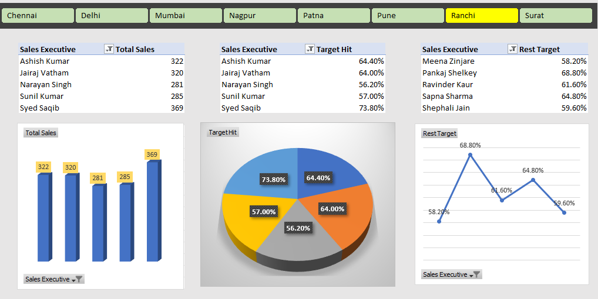

# 📊 Excel Dashboard Project

This project is an interactive Excel dashboard designed to visualize and interact with sales data across multiple regions and executives.

## 🔧 Features
- Slicers to filter by city
- Pivot tables and dynamic charts
- Total sales, target hit%, and rest target analysis

## 📁 Files Included
- `Project1.xlsm` — Excel dashboard 
- `Excel_Dashboard_Converted.png` — Preview image

## 📷 Preview

---

## 👤 Author
Abhay Garg  
Looking for internship opportunities in data analysis, Excel automation, and dashboard development.
